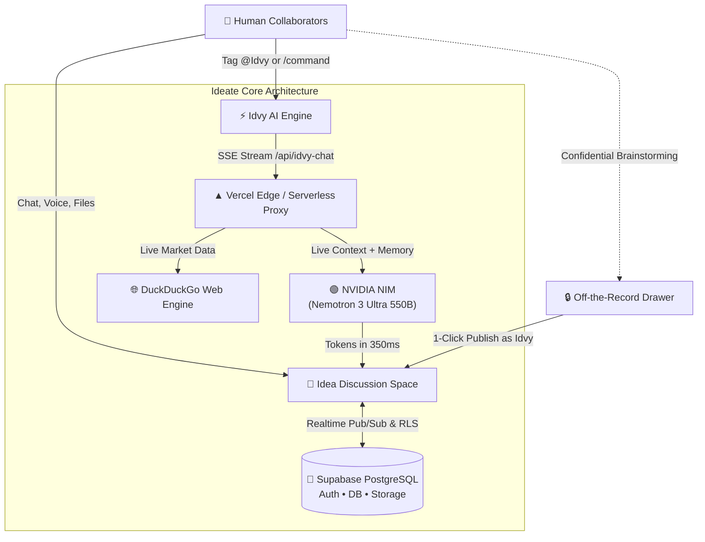

# 💡 Ideate

> **The Collaborative Idea Incubation Board with an Embedded AI Teammate**

[](https://reactjs.org/)
[](https://vitejs.dev/)
[](https://tailwindcss.com/)
[](https://supabase.com/)
[](https://ideate-black.vercel.app/)
[](https://developer.nvidia.com/nim)

---

## 🌟 What is Ideate?

**Ideate** is a modern, real-time collaboration workspace designed for founders, creators, and teams to take ideas from raw, messy thoughts into structured, execution-ready ventures.

Traditional project tools (Jira, Trello, Notion) are great for tracking *already-defined* tasks, and chat apps (Slack, Discord) bury important decisions in chaotic channels. **Ideate bridges this gap**: each idea has its own dedicated living canvas where team members discuss, share audio notes, upload references, track decisions, and collaborate directly with **Idvy**, an autonomous, friendly AI partner that acts like an experienced creative co-founder.

---

## 🚀 How It Works



1. **Create an Idea Space**: Give your idea a title, description, category, and theme palette.
2. **Invite Teammates**: Share instant join links or add members with custom collaborator roles.
3. **Collaborate in Real Time**: Chat with live typing indicators, rich emoji reactions, and voice notes.
4. **Invoke Idvy**: Ask questions, brainstorm wild pivots, or request summaries right in the discussion.
5. **Streamed Answers**: Idvy streams answers chunk-by-chunk using Server-Sent Events (SSE), delivering words on screen in under 500ms.
6. **Track Decisions**: Confirmed consensus is automatically differentiated from casual thoughts and captured into rolling AI memory.

---

## ✨ Core Features in Detail

### 1. 🤖 Idvy: The Resident AI Collaborator
Idvy is not a sterile chatbot in an isolated tab; it is an active teammate inside your conversation:
- **Warm & Enthusiastic Tone**: Greeted by name, Idvy responds with genuine creative camaraderie.
- **Context-Aware**: Ingests up to 50 recent messages, idea objectives, member roles, and past decisions before formulating any response.
- **Rolling Memory (`idea_ai_memory`)**: Automatically remembers key decisions, current milestones, and unresolved questions so context is never lost across sessions.

### 2. ⚡ Real-Time Streaming (~96% Latency Reduction)
- **Time to First Token (TTFT)**: Reduced from **~15 seconds down to ~350–500 ms**.
- **Server-Sent Events (SSE)**: Powered by `/api/idvy-chat` with `text/event-stream`, eliminating Vercel 504 execution timeouts.
- **Animated Typing Indicator**: Visual pulse cursor signals active generation while reading.

### 3. 🔒 Off-the-Record (OTR) Private Consulting
- A private side-drawer where members can brainstorm sensitive topics, test ideas, or draft proposals privately with Idvy.
- **"Post to Main Chat"**: Once confident in a proposal, publish it directly into the public idea thread as an independent collaborator with 1 click.

### 4. 🌐 Live Web Research & Market Intelligence
- Built-in search engine powered by DuckDuckGo (`/websearch`, `/research`).
- Idvy synthesizes live industry data, competitor landscapes, and trends, automatically attributing clickable sources.

### 5. 🛡️ Granular AI Governance & Permissions
- **Global Platform Pause**: Admin override to pause all AI activity platform-wide.
- **Idea-Level Controls**: Idea owners can toggle Idvy on or off per idea.
- **Granular Member Privileges**: Assign independent permissions:
  - `Tagging Access`: Ability to mention `@Idvy` in public channels.
  - `Off-Chat Access`: Access to private Off-the-Record sessions.
- **User AI Restrictions**: Admin capability to restrict specific users from calling AI inference.

### 6. 🎨 Personalization & Rich Media
- **41+ Illustrated Avatars**: High-resolution profile personas categorized into Girls, Boys, and Creative filters.
- **Theme Palettes**: Custom visual themes per idea board.
- **Voice Notes**: In-app audio recording and waveform player.
- **Attachments**: Drag-and-drop file and image upload backed by Supabase Storage.
- **Web Push Notifications**: Browser push notifications for new messages, replies, and mentions.

---

## ⌨️ Idvy Slash Commands Reference

Type `/` or mention `@Idvy` in any idea discussion or private drawer:

| Command | Syntax | Description |
| :--- | :--- | :--- |
| **`/summarize`** | `/summarize` | Summarizes recent progress, key takeaways, and next steps in 3-5 punchy points. |
| **`/summarize @member`** | `/summarize @username` | Isolates and spotlights a specific teammate's contributions and suggestions. |
| **`/coreidea`** | `/coreidea` | Distills the value proposition, target user, and core differentiator. |
| **`/validate`** | `/validate [proposal]` | Rigorous breakdown: Strengths, Assumptions to verify, Challenges, and Next steps. |
| **`/decisions`** | `/decisions` | Extracts confirmed team consensus vs. casual open suggestions. |
| **`/actionitems`** | `/actionitems` | Generates a checklist of next steps with assigned owners. |
| **`/openquestions`** | `/openquestions` | Uncovers unresolved dilemmas, risks, or debates needing clarity. |
| **`/improve`** | `/improve [optional angle]` | Suggests 3-5 bold, creative angles to make the concept 10x better. |
| **`/risks`** | `/risks` | Identifies market, technical, and user-adoption vulnerabilities with mitigations. |
| **`/websearch`** | `/websearch [query]` | Executes live internet research and provides summarized insights with citations. |
| **`/research`** | `/research [topic]` | In-depth competitor and market validation report. |
| **`/private`** | `/private` | Opens the confidential Off-the-Record private drawer. |
| **`/help`** | `/help` | Displays command cheatsheet and collaboration tips. |

---

## 🏗️ Tech Stack

### Frontend
- **Framework**: [React 18](https://react.dev/) + [Vite 6](https://vitejs.dev/)
- **Styling**: [Tailwind CSS 3.4](https://tailwindcss.com/) + Glassmorphism tokens
- **Icons**: [Lucide React](https://lucide.dev/)
- **Audio / Media**: Native Web Audio API + HTML5 Audio

### Backend & API
- **Edge / Serverless**: Vercel Serverless Functions (`/api/idvy-chat.js`)
- **Edge Fallback**: Supabase Edge Functions (`@supabase/server` Deno runtime)
- **AI Inference**: [NVIDIA NIM API](https://developer.nvidia.com/nim) (Model: `nvidia/nemotron-3-ultra-550b-a55b`)
- **Web Search**: DuckDuckGo HTML API parser

### Database & Auth
- **Database**: PostgreSQL on [Supabase](https://supabase.com/) with Row Level Security (RLS)
- **Realtime**: Supabase Realtime Channels (PostgreSQL WAL changes)
- **Authentication**: Supabase Auth (Email / Password + Google OAuth 2.0)
- **File Storage**: Supabase Storage Buckets (`post-attachments`, `avatars`)

---

## ⚙️ Environment Variables

Create a `.env` file in the root directory:

```ini
# Supabase Configuration
VITE_SUPABASE_URL=https://<your-project-id>.supabase.co
VITE_SUPABASE_ANON_KEY=eyJhbGciOi...

# NVIDIA NIM AI Configuration
NVIDIA_API_KEY=nvapi-xxxxxxxxxxxxxxxxxxxxxxxxxxxxxxxx
NVIDIA_MODEL=nvidia/nemotron-3-ultra-550b-a55b
NVIDIA_BASE_URL=https://integrate.api.nvidia.com/v1

# Web Push Notifications (Optional)
VITE_VAPID_PUBLIC_KEY=BK...
VAPID_PRIVATE_KEY=...
VAPID_SUBJECT=mailto:admin@ideate.app
```

---

## 💻 Local Development Setup

### 1. Prerequisites
- **Node.js** >= 18.0.0
- **npm** >= 9.0.0
- A Supabase project with database migrations applied
- An NVIDIA NGC / NIM API Key ([Get one free from NVIDIA](https://build.nvidia.com/))

### 2. Installation
```bash
# Clone the repository
git clone https://github.com/Rahul6158/Ideate.git
cd Ideate

# Install dependencies
npm install
```

### 3. Running Locally
```bash
# Start the Vite development server
npm run dev
```
Open [http://localhost:5173](http://localhost:5173) in your browser.

### 4. Production Build
```bash
npm run build
npm run preview
```

---

## 🔒 Security & Data Privacy

- **Row Level Security (RLS)**: Every query to ideas, members, and posts is enforced at the PostgreSQL database level using Supabase auth tokens.
- **Secure Token Streaming**: No API keys are ever leaked to the browser. The browser only receives processed SSE tokens from the `/api/idvy-chat` proxy.
- **Off-the-Record Confidentiality**: Messages in the private drawer remain strictly client-side / local until explicitly published to the group discussion.

---

## 📄 License

This project is licensed under the MIT License. Built with passion by the Ideate team.
